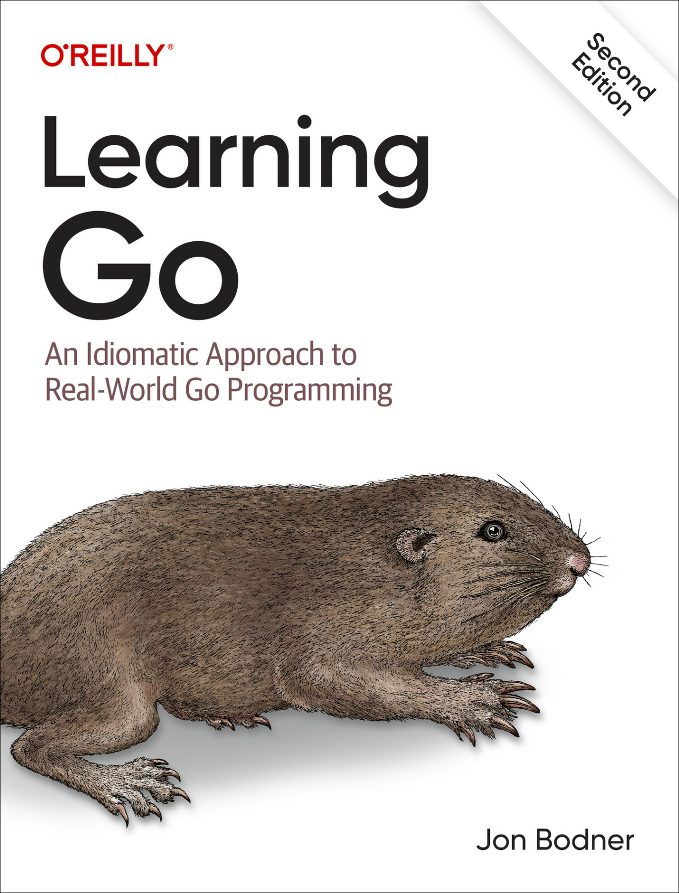

# My Notes from "Learning Go" by Jon Bodner


## Book Resources
- [Book Code Examples](https://github.com/learning-go-book-2e)
- [Book Website](https://learning.oreilly.com/library/view/learning-go-2nd/9781098139285/)

# Go Language Resources
- [Effective Go](https://go.dev/doc/effective_go)
- [Go Wiki: Go Code Review Comments](https://go.dev/wiki/CodeReviewComments)
- [Go in VSCode](https://code.visualstudio.com/docs/languages/go)
- [Delve Debugger](https://github.com/go-delve/delve/)

## Helpful Commands

```powershell
go version                      # Check Go version
go mod init hello_world         # Initialize a new module
go fmt ./...                    # Format all Go files in the current directory
go vet ./...                    # Check for potential issues in the code
go build                        # Build the current package
go build -o hello.exe           # Build and name the output file to another name
go install github.com/go-delve/delve/cmd/dlv@latest # Install Delve debugger
```
