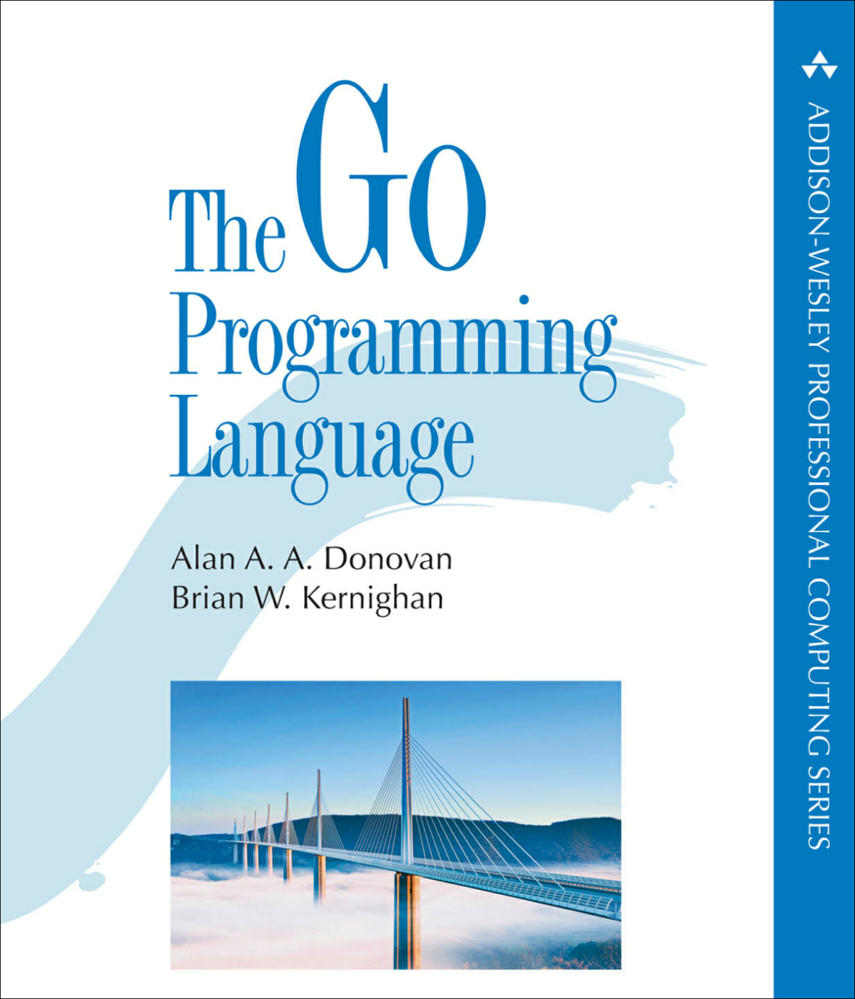
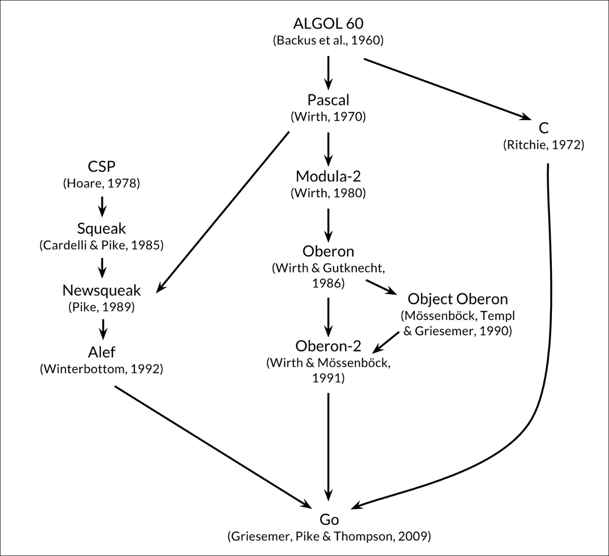
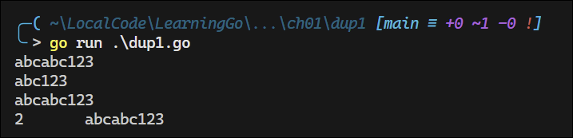
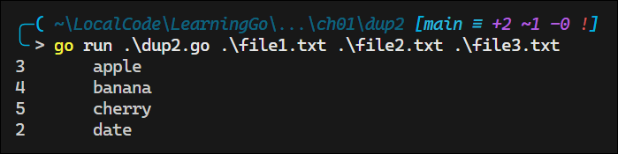
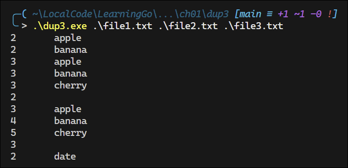
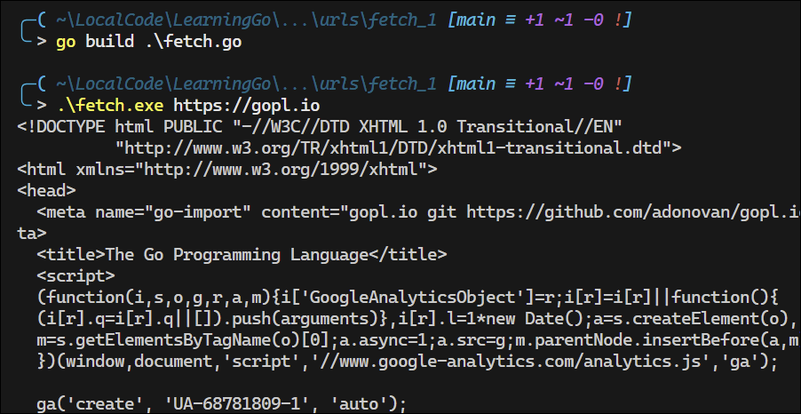

# My Notes from "The Go Programming Language" by Alan A. A. Donovan and Brian W. Kernighan



<details>
<summary>Book Resources</summary>

- [Official Book Website](https://www.gopl.io/)
- [Source Code Examples](https://github.com/adonovan/gopl.io)

</details>

## Go Commands 

```Go
go run hello.go         // Run the program hello.go
go build hello.go       // Build the program hello.go into an executable file
```


## Overview and History of Go

- **Conception**: Go was conceived in 2007 by Robert Griesemer, Rob Pike, and Ken Thompson at Google and was publicly announced in 2009.

- **Influencers of Go**:
  
  

  - **C**: Syntax, control structures, basic data types, call-by-value parameter passing, pointers, and emphasis on compiling to machine code.
  - **Modula-2**: Inspired the package concept.
  - **Oberon**: Eliminated the distinction between module interface files and module implementation files.
  - **Oberon-2**: Influenced syntax for packages and declarations, particularly method declarations.
  - **CSP (Communicating Sequential Processes)**: Influenced goroutines and channels.
  - **Squeak**: Provided handling for mouse and keyboard events, with statically created channels.
  - **Newsqueak**: A purely functional language with garbage collection, aimed at managing keyboard, mouse, and window events.
  - **Alef**: Attempted to make Newsqueak a viable system programming language, but its lack of garbage collection made concurrency too painful.

### The Go Project

- **Motivation**: The Go project was born out of frustration with several software systems at Google that were suffering from an explosion of complexity.
- **Components**:
  - The language itself.
  - Its tools and standard libraries.
  - A cultural agenda of radical simplicity.
- **Features**:
  - Garbage collection.
  - A package system.
  - First-class functions.
  - Lexical scope.
  - A system call interface.
  - Immutable strings.
- **Minimalism**:
  - Go has comparatively few features and is unlikely to add more.
  - **Notable omissions**:
    - No implicit numeric conversions.
    - No constructors or destructors.
    - No operator overloading.
    - No default parameter values.
    - No inheritance.
    - No generics.
    - No exceptions.
    - No macros.
    - No function annotations.
    - No thread-local storage.

## 1. Tutorial

The following program can be compiled and ran with `go run hello.go`:

```
package main

import "fmt"

func main() {
    fmt.Println("Hello, world!")
}
```

The command `go build hello.go` creates an executable file.

- Go code is organized into packages, which are similar to libraries or modules in other languages.
- Each source file begins with a package declaration, which states the package the file belongs go.

```Go
package main
```

- You must import *exactly* the packages you need. The Go compiler will not compile a package if it is not used in the code.
- Go does not require semicolons; they are automatically inserted at the end of lines.

### 1.2 Command-Line Arguments

The `os.Args` variable is a slice of strings containing the command-line arguments.
  - `os.Args[0]` is the name of the command.
  - `os.Args[1:]` contains the arguments passed to the program.

Example: Concatenating and printing command-line arguments (index-based loop):

    ```go
    package main

    import (
        "fmt"
        "os"
    )

    func main() {
        var s, sep string
        for i := 1; i < len(os.Args); i++ {
            s += sep + os.Args[i]
            sep = " "
        }
        fmt.Println(s)
    }
    ```

  - `var` declares variables; uninitialized variables get the zero value (`""` for strings).
  - The `+` operator concatenates strings.
  - `:=` is the short variable declaration, inferring the type.
  - `i++` is the only increment operator (no prefix form).
  - Parentheses are not used in the `for` statement.
  - Braces are required, and the opening brace must be on the same line as the `for`.
  - Any part of the `for` statement (init, condition, post) can be omitted.

Example: Using a range-based for loop:

    ```go
    package main

    import (
        "fmt"
        "os"
    )

    func main() {
        s, sep := "", ""
        for _, arg := range os.Args[1:] {
            s += sep + arg
            sep = " "
        }
        fmt.Println(s)
    }
    ```

    - Each iteration of the `range` loop provides the index and value.
    - The blank identifier `_` is used to ignore the index when not needed.

Variable declaration styles:

 ```go
 s := ""             // short variable declaration
 var s string        // var declaration
 var s = ""          // var declaration with initialization
 var s string = ""   // var declaration with type and initialization
 ```

  - `:=` can only be used inside functions.
  - The second form uses the zero value for initialization.
  - The third and fourth forms are more explicit but less common in practice.

### 1.3 Funding Duplicate Lines

This section covers three variants of a program called `dup`, partially inspired by the Unix command `uniq`, which looks for adjacent duplicate lines.

**`Dup` Version 1**: prints each line that appears more than once in the input, preceeded by its count.

```go
package main

import (
	"bufio"
	"fmt"
	"os"
)

// Main function: Reads input, counts duplicate lines, and prints results.
func main() {
	// Create a map to store line counts
	counts := make(map[string]int)

	// Initialize a scanner to read from standard input
	input := bufio.NewScanner(os.Stdin)

	// Loop to read each line of input
	for input.Scan() {
		counts[input.Text()]++
	}

	// Iterate over the map to find duplicates and print results
	for line, n := range counts {
		if n > 1 {
			fmt.Printf("%d\t%s\n", n, line)
		}
	}
}
```
[File: `dup1.go`](./ch01/duplicate_lines/dup1/dup1.go).

**Output:**  


Things to note:
- A `map` holds a set of key-value pairs and provides constant-time access to the store.
- The key may be any type whose values  can be compared with `==`, strings being the most common.
- In this example, the key is a string and the value is an `int`.
- The build-in function creates a new empty map.
- The statement `counts[input.Text()]++` is a shorthand for the following:
```go
line := input.Text()
counts[line] = counts[line] + 1
```
- Each time `dup` reads a line of input, the line is used as a key in the map, and the value is incremented by 1.
- The `bufio` package provides Scanner, which is the easiest way to process input that naturally consists of lines.
- The `Scan` function returns `true` if there is another line to read, and `false` when the input is exhausted.
- The following table summarizes the format verbs used in `fmt.Printf`:

| Format     | Description                           |
| ---------- | ------------------------------------- |
| %d         | decimal integer                       |
| %x, %o, %b | integer in hexadecimal, octal, binary |
| %f         | floating-point number: 3.141593       |
| %g, %e     | 3.141592653589793  3.141593e+00       |
| %t         | boolean: true or false                |
| %c         | rune (Unicode code point)             |
| %s         | string                                |
| %q         | quoted string "abc" or rune 'c'       |
| %v         | any value in a natural format         |
| %T         | type of any value                     |
| %%         | literal percent sign (no operand)     |
- `printf` does not add a newline at the end of the output, so you need to add it manually with `\n`.


**`Dup` Version 2**: reads from files and counts duplicate lines.

```go
package main

import (
	"bufio"
	"fmt"
	"os"
)

// main creates a map to track line counts, processes input from stdin or files,
// and then displays any lines that appear more than once
func main() {
	counts := make(map[string]int)
	files := os.Args[1:]
	if len(files) == 0 {
		countLines(os.Stdin, counts)
	} else {
		for _, arg := range files {
			f, err := os.Open(arg)
			if err != nil {
				fmt.Fprintf(os.Stderr, "dup2: %v\n", err)
				continue
			}
			countLines(f, counts)
			f.Close()
		}
	}
	for line, n := range counts {
		if n > 1 {
			fmt.Printf("%d\t%s\n", n, line)
		}
	}
}

// countLines reads input lines from a file and counts occurrences in the map
func countLines(f *os.File, counts map[string]int) {
	input := bufio.NewScanner(f)
	for input.Scan() {
		counts[input.Text()]++
	}
	// NOTE: ignoring potential errors from input.Err()
}
```
[File: `dup2.go`](./ch01/duplicate_lines/dup2/dup2.go).

**Output:**  


Things to note:
- The function `os.Open` returns two values: a file pointer and an error value.
- If `err` is not `nil`, something went wrong while opening the file.
- The verb `%v` in `fmt.Printf` is used to print the value in a default format.
- The call to `countLines` precedes its declaraion; functions and other package-level declarations can be in any order.
- A `map` is a reference to a data structure created by the `make` function.
- When a `map` is passed to a function, the function receives a copy of the reference to the map, not a copy of the map itself.
- Any changes made to the map in the function are reflected in the original map.


The prior two versions of `dup` are not very efficient because input is read and broken into lines as needed. An alternative approach is to read the entire input into memory and then process it. This is done in the third version of `dup`.

**`Dup` Version 3**: reads from files and counts duplicate lines, but reads the entire input into memory first.

```go
package main

import (
	"fmt"
	"io/ioutil"
	"os"
	"strings"
)

func main() {
	// Create a map to store line counts
	counts := make(map[string]int)

	// Process each file specified on the command line
	for _, filename := range os.Args[1:] {
		// Read entire file contents at once
		data, err := ioutil.ReadFile(filename)
		if err != nil {
			fmt.Fprintf(os.Stderr, "dup3: %v\n", err)
			continue
		}

		// Count occurrences of each line
		for _, line := range strings.Split(string(data), "\n") {
			counts[line]++
		}

		// Display lines that appear more than once
		for line, n := range counts {
			if n > 1 {
				fmt.Printf("%d\t%s\n", n, line)
			}
		}
	}
}
```
[File: `dup3.go`](./ch01/duplicate_lines/dup3/dup3.go).

**Output:**  


Things to note:
- `ReadFile` contains a byte slice that must be converted to a string before it can be split into lines.

**Exercise 1.4**: Modify the `dup2` program to print the names of all files in which each duplicated line occurs.  
[File: `dup4.go`](./ch01/duplicate_lines/ex1_4-dup4/dup4.go).

### 1.4 Animated GIFs

This next program demonstrates the use of Go's standard image packages to create *Lissajous figures*, which are parametric curves produced by harmonic oscillation in two dimensions.

New constructs introduced in this program include: const declarations, struct types, composite literals.

```go
package main

import (
	"image"
	"image/color"
	"image/gif"
	"io"
	"math"
	"math/rand"
	"os"
)

// This block defines the color palette and constants for color indices
var palette = []color.Color{color.White, color.Black} 	// Composite literal for color.Color slice

const (
	whiteIndex = 0
	blackIndex = 1
)

func main() {
	lissajous(os.Stdout)
}

func lissajous(out io.Writer) {
	const (
		cycles  = 5     // number of complete x oscillator revolutions
		res     = 0.001 // angular resolution
		size    = 100   // image canvas covers [-size..+size]
		nframes = 64    // number of frames in the animation
		delay   = 8     // delay between frames in 10ms units
	)

	freq  := rand.Float64() * 3.0           // relative frequency of y oscillator
	anim  := gif.GIF{LoopCount: nframes}	// composite literal for gif.GIF struct
	phase := 0.0                            // phase difference
	for i := 0; i < nframes; i++ {
		rect := image.Rect(0, 0, 2 * size + 1, 2 * size + 1)
		img := image.NewPaletted(rect, palette)
		for t := 0.0; t < cycles * 2 * math.Pi;  t += res {
			x := math.Sin(t)
			y := math.Sin(t * freq + phase)
			img.SetColorIndex(size + int(x * size + 0.5), size + int(y * size + 0.5), blackIndex)
		}
		phase += 0.1
		anim.Delay = append(anim.Delay, delay)
		anim.Image = append(anim.Image, img)
	}
	gif.EncodeAll(out, &anim)  // Note: using gif.EncodeAll instead of gif.Encode
}
```
[File: `lissajous.go`](./ch01/animated_gifs/lissajous_1/lissajous.go).

The output:  
.

Things to note:
- After importing a package whose path has multiple components, like `image/color`, you can refer to the package by its last component, like `color`, e.g. `color.White`.
- A `const` declaration declareas values that are fixed at compile time. `const` declarations may be used at the package level or inside functions.
- The expressions `[]color.Color{...}` and `gif.GIF{...}` are *composite literals*, a compact notation for instantiating any of Go's composite types, including structs, arrays, and slices.
- The type `gif.GIF` is a struct type, which is a collection of fields, each with a name and type. 

**Exercise 1.5**: Change the Lissajous program’s color palette to green on black, for added authenticity. To create the web color #RRGGBB, use color.RGBA{0xRR, 0xGG, 0xBB, 0xff}, where each pair of hexadecimal digits represents the intensity of the red, green, or blue component of the pixel.

[File: `lissajous.go`](./ch01/animated_gifs/lissajous_ex1_5/lissajous.go).

**Output:**  


**Exercise 1.6**: Modify the Lissajous program to produce images in multiple colors by adding more values to palette and then displaying them by changing the third argument of SetColorIndex in some interesting way.

[File: `lissajous.go`](./ch01/animated_gifs/lissajous_ext1_6/lissajous.go).

**Output:**  


### 1.5 Fetching a URL

```go
package main

import (
	"fmt"
	"io/ioutil"
	"net/http"
	"os"
)

func main() {
	for _, url := range os.Args[1:] {
		// Make HTTP GET request to the URL and store result in resp struct
		resp, err := http.Get(url)
		if err != nil {
			fmt.Fprintf(os.Stderr, "fetch: %v\n", err)
			os.Exit(1)
		}
		// Read the response and store it in b
		b, err := ioutil.ReadAll(resp.Body)
		resp.Body.Close()
		if err != nil {
			fmt.Fprintf(os.Stderr, "fetch: reading %s: %v\n", url, err)
			os.Exit(1)
		}
		fmt.Printf("%s", b)
	}
}
```
[File: `fetch.go`](./ch01/urls/fetch_1/fetch.go).

**Output:**  


**Exercise 1.7**: The function call io.Copy(dst, src) reads from src and writes to dst. Use it instead of ioutil.ReadAll to copy the response body to os.Stdout without requiring a buffer large enough to hold the entire stream. Be sure to check the error result of io.Copy.
