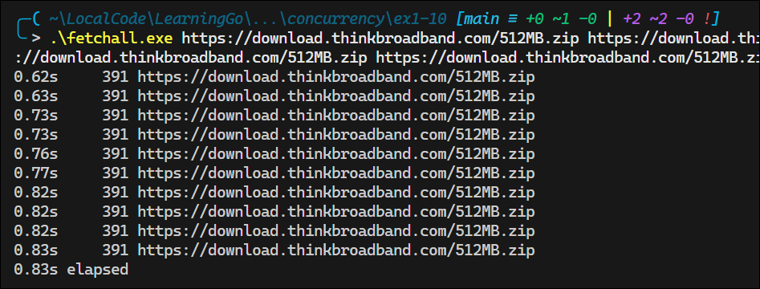
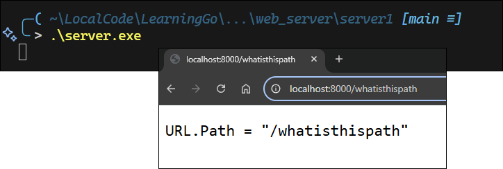
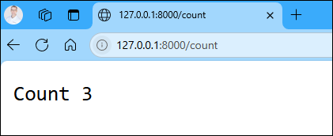
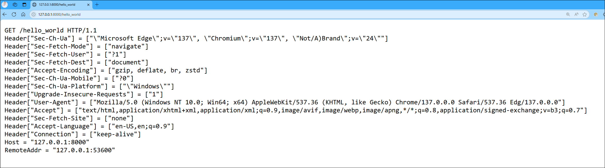
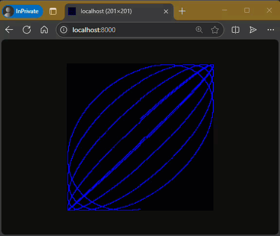
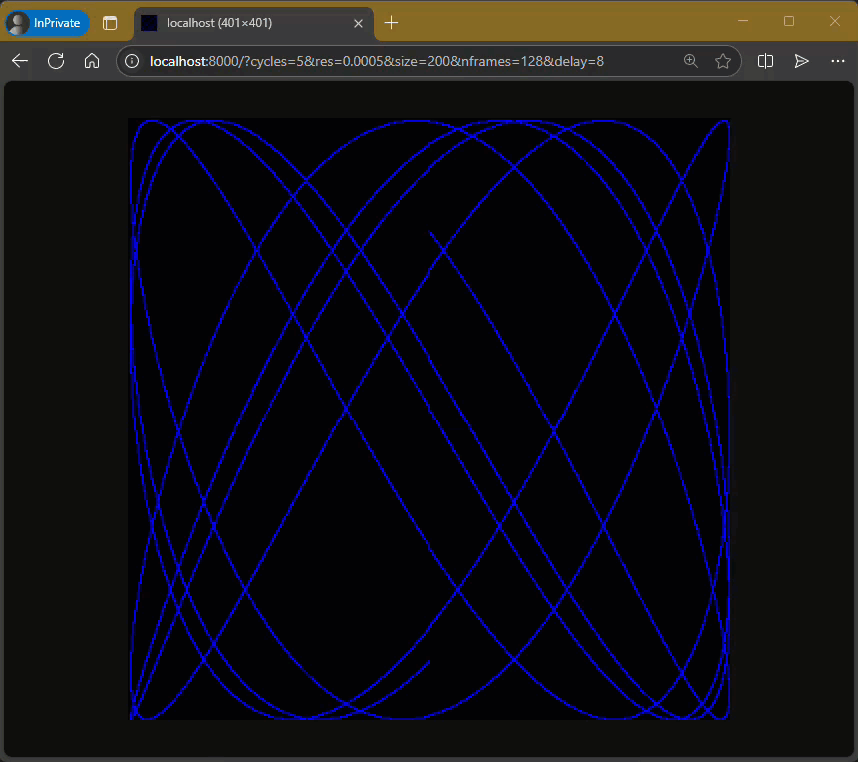

# My Notes from "The Go Programming Language" by Alan A. A. Donovan and Brian W. Kernighan


<details>
<summary>Book Resources</summary>

- [Official Book Website](https://www.gopl.io/)
- [Source Code Examples](https://github.com/adonovan/gopl.io)

</details>

<!-- omit in toc -->
## Go Commands 

```Go
go run hello.go                         // Run the program hello.go
go fmt hello.go                         // Format the code in hello.go
go build hello.go                       // Build the program hello.go into an executable file
go clean -cache                         // Clean the Go build cache
go build -x -v hello.go                 // Build the program with verbose output
go doc http.Get                         // Show documentation for the http.Get function
```
<!-- omit in toc -->
## Contents

- [Overview and History of Go](#overview-and-history-of-go)
  - [The Go Project](#the-go-project)
- [1. Tutorial](#1-tutorial)
  - [1.2 Command-Line Arguments](#12-command-line-arguments)
  - [1.3 Funding Duplicate Lines](#13-funding-duplicate-lines)
  - [1.4 Animated GIFs](#14-animated-gifs)
  - [1.5 Fetching a URL](#15-fetching-a-url)
  - [1.6 Fetching URLs Concurrently](#16-fetching-urls-concurrently)
  - [1.7 A Web Server](#17-a-web-server)
  - [1.8 Loose Ends](#18-loose-ends)
- [2. Program Structure](#2-program-structure)
  - [2.1 Names](#21-names)
  - [2.2 Declarations](#22-declarations)
  - [2.3 Variables](#23-variables)
    - [2.3.1 Short Variable Declarations](#231-short-variable-declarations)
    - [2.3.2 Pointers](#232-pointers)
    - [2.3.3 The `new` Function](#233-the-new-function)
    - [2.3.4 Lifetime of Variables](#234-lifetime-of-variables)


## Overview and History of Go

**Conception**: Go was conceived in 2007 by Robert Griesemer, Rob Pike, and Ken Thompson at Google and was publicly announced in 2009.

**Influencers of Go**:
  
  

  - **C**: Syntax, control structures, basic data types, call-by-value parameter passing, pointers, and emphasis on compiling to machine code.
  - **Modula-2**: Inspired the package concept.
  - **Oberon**: Eliminated the distinction between module interface files and module implementation files.
  - **Oberon-2**: Influenced syntax for packages and declarations, particularly method declarations.
  - **CSP (Communicating Sequential Processes)**: Influenced goroutines and channels.
  - **Squeak**: Provided handling for mouse and keyboard events, with statically created channels.
  - **Newsqueak**: A purely functional language with garbage collection, aimed at managing keyboard, mouse, and window events.
  - **Alef**: Attempted to make Newsqueak a viable system programming language, but its lack of garbage collection made concurrency too painful.

### The Go Project

- **Motivation**: The Go project was born out of frustration with several software systems at Google that were suffering from an explosion of complexity.
- **Components**:
  - The language itself.
  - Its tools and standard libraries.
  - A cultural agenda of radical simplicity.
- **Features**:
  - Garbage collection.
  - A package system.
  - First-class functions.
  - Lexical scope.
  - A system call interface.
  - Immutable strings.
- **Minimalism**:
  - Go has comparatively few features and is unlikely to add more.
  - **Notable omissions**:
    - No implicit numeric conversions.
    - No constructors or destructors.
    - No operator overloading.
    - No default parameter values.
    - No inheritance.
    - No generics.
    - No exceptions.
    - No macros.
    - No function annotations.
    - No thread-local storage.

## 1. Tutorial

The following program can be compiled and ran with `go run hello.go`:

```go
package main

import "fmt"

func main() {
    fmt.Println("Hello, world!")
}
```

The command `go build hello.go` creates an executable file.

- Go code is organized into packages, which are similar to libraries or modules in other languages.
- Each source file begins with a package declaration, which states the package the file belongs go.

```Go
package main
```

- You must import *exactly* the packages you need. The Go compiler will not compile a package if it is not used in the code.
- Go does not require semicolons; they are automatically inserted at the end of lines.

### 1.2 Command-Line Arguments

The `os.Args` variable is a slice of strings containing the command-line arguments.
  - `os.Args[0]` is the name of the command.
  - `os.Args[1:]` contains the arguments passed to the program.

**Example:** Concatenating and printing command-line arguments (index-based loop):

```go
package main

import (
    "fmt"
    "os"
)

func main() {
    var s, sep string
    for i := 1; i < len(os.Args); i++ {
        s += sep + os.Args[i]
        sep = " "
    }
    fmt.Println(s)
}
```

- `var` declares variables; uninitialized variables get the zero value (`""` for strings).
- The `+` operator concatenates strings.
- `:=` is the short variable declaration, inferring the type.
- `i++` is the only increment operator (there is no prefix form).
- Parentheses are not used in the `for` statement.
- Braces are required, and the opening brace must be on the same line as the `for`.
- Any part of the `for` statement (init, condition, post) can be omitted.

**Example:** Using a range-based for loop:

```go
package main

import (
    "fmt"
    "os"
)

func main() {
    s, sep := "", ""
    for _, arg := range os.Args[1:] {
        s += sep + arg
        sep = " "
    }
    fmt.Println(s)
}
```

  - Each iteration of the `range` loop provides the index and value.
  - The blank identifier `_` is used to ignore the index when not needed.

Variable declaration styles:

 ```go
 s := ""             // short variable declaration
 var s string        // var declaration
 var s = ""          // var declaration with initialization
 var s string = ""   // var declaration with type and initialization
 ```

  - `:=` can only be used inside functions.
  - The second form uses the zero value for initialization.
  - The third and fourth forms are more explicit but less common in practice.

### 1.3 Funding Duplicate Lines

This section covers three variants of a program called `dup`, partially inspired by the Unix command `uniq`, which looks for adjacent duplicate lines.

**`Dup` Version 1**: prints each line that appears more than once in the input, preceeded by its count.

```go
package main

import (
    "bufio"
    "fmt"
    "os"
)

// Main function: Reads input, counts duplicate lines, and prints results.
func main() {
    // Create a map to store line counts
    counts := make(map[string]int)

    // Initialize a scanner to read from standard input
    input := bufio.NewScanner(os.Stdin)

    // Loop to read each line of input
    for input.Scan() {
        counts[input.Text()]++
    }

    // Iterate over the map to find duplicates and print results
    for line, n := range counts {
        if n > 1 {
            fmt.Printf("%d\t%s\n", n, line)
        }
    }
}
```
[File: `dup1.go`](./ch01/duplicate_lines/dup1/dup1.go).

**Output:**  


Things to note:
- A `map` holds a set of key-value pairs and provides constant-time access to the store.
- The key may be any type whose values  can be compared with `==`, strings being the most common.
- In this example, the key is a string and the value is an `int`.
- The build-in function creates a new empty map.
- The statement `counts[input.Text()]++` is a shorthand for the following:
```go
line := input.Text()
counts[line] = counts[line] + 1
```
- Each time `dup` reads a line of input, the line is used as a key in the map, and the value is incremented by 1.
- The `bufio` package provides Scanner, which is the easiest way to process input that naturally consists of lines.
- The `Scan` function returns `true` if there is another line to read, and `false` when the input is exhausted.
- The following table summarizes the format verbs used in `fmt.Printf`:

| Format     | Description                           |
| ---------- | ------------------------------------- |
| %d         | decimal integer                       |
| %x, %o, %b | integer in hexadecimal, octal, binary |
| %f         | floating-point number: 3.141593       |
| %g, %e     | 3.141592653589793  3.141593e+00       |
| %t         | boolean: true or false                |
| %c         | rune (Unicode code point)             |
| %s         | string                                |
| %q         | quoted string "abc" or rune 'c'       |
| %v         | any value in a natural format         |
| %T         | type of any value                     |
| %%         | literal percent sign (no operand)     |
- `printf` does not add a newline at the end of the output, so you need to add it manually with `\n`.


**`Dup` Version 2**: reads from files and counts duplicate lines.

```go
package main

import (
    "bufio"
    "fmt"
    "os"
)

// main creates a map to track line counts, processes input from stdin or files,
// and then displays any lines that appear more than once
func main() {
    counts := make(map[string]int)
    files := os.Args[1:]
    if len(files) == 0 {
        countLines(os.Stdin, counts)
    } else {
        for _, arg := range files {
            f, err := os.Open(arg)
            if err != nil {
                fmt.Fprintf(os.Stderr, "dup2: %v\n", err)
                continue
            }
            countLines(f, counts)
            f.Close()
        }
    }
    for line, n := range counts {
        if n > 1 {
            fmt.Printf("%d\t%s\n", n, line)
        }
    }
}

// countLines reads input lines from a file and counts occurrences in the map
func countLines(f *os.File, counts map[string]int) {
    input := bufio.NewScanner(f)
    for input.Scan() {
        counts[input.Text()]++
    }
    // NOTE: ignoring potential errors from input.Err()
}
```
[File: `dup2.go`](./ch01/duplicate_lines/dup2/dup2.go).

**Output:**  


Things to note:
- The function `os.Open` returns two values: a file pointer and an error value.
- If `err` is not `nil`, something went wrong while opening the file.
- The verb `%v` in `fmt.Printf` is used to print the value in a default format.
- The call to `countLines` precedes its declaraion; functions and other package-level declarations can be in any order.
- A `map` is a reference to a data structure created by the `make` function.
- When a `map` is passed to a function, the function receives a copy of the reference to the map, not a copy of the map itself.
- Any changes made to the map in the function are reflected in the original map.


The prior two versions of `dup` are not very efficient because input is read and broken into lines as needed. An alternative approach is to read the entire input into memory and then process it. This is done in the third version of `dup`.

**`Dup` Version 3**: reads from files and counts duplicate lines, but reads the entire input into memory first.

```go
package main

import (
    "fmt"
    "io/ioutil"
    "os"
    "strings"
)

func main() {
    // Create a map to store line counts
    counts := make(map[string]int)

    // Process each file specified on the command line
    for _, filename := range os.Args[1:] {
        // Read entire file contents at once
        data, err := ioutil.ReadFile(filename)
        if err != nil {
            fmt.Fprintf(os.Stderr, "dup3: %v\n", err)
            continue
        }

        // Count occurrences of each line
        for _, line := range strings.Split(string(data), "\n") {
            counts[line]++
        }

        // Display lines that appear more than once
        for line, n := range counts {
            if n > 1 {
                fmt.Printf("%d\t%s\n", n, line)
            }
        }
    }
}
```
[File: `dup3.go`](./ch01/duplicate_lines/dup3/dup3.go).

**Output:**  


Things to note:
- `ReadFile` contains a byte slice that must be converted to a string before it can be split into lines.

**Exercise 1.4**: Modify the `dup2` program to print the names of all files in which each duplicated line occurs.  
[File: `dup4.go`](./ch01/duplicate_lines/ex1_4-dup4/dup4.go).

### 1.4 Animated GIFs

This next program demonstrates the use of Go's standard image packages to create *Lissajous figures*, which are parametric curves produced by harmonic oscillation in two dimensions.

New constructs introduced in this program include: const declarations, struct types, composite literals.

```go
package main

import (
    "image"
    "image/color"
    "image/gif"
    "io"
    "math"
    "math/rand"
    "os"
)

// This block defines the color palette and constants for color indices
var palette = []color.Color{color.White, color.Black}   // Composite literal for color.Color slice

const (
    whiteIndex = 0
    blackIndex = 1
)

func main() {
    lissajous(os.Stdout)
}

func lissajous(out io.Writer) {
    const (
        cycles  = 5     // number of complete x oscillator revolutions
        res     = 0.001 // angular resolution
        size    = 100   // image canvas covers [-size..+size]
        nframes = 64    // number of frames in the animation
        delay   = 8     // delay between frames in 10ms units
    )

    freq  := rand.Float64() * 3.0           // relative frequency of y oscillator
    anim  := gif.GIF{LoopCount: nframes}    // composite literal for gif.GIF struct
    phase := 0.0                            // phase difference
    for i := 0; i < nframes; i++ {
        rect := image.Rect(0, 0, 2 * size + 1, 2 * size + 1)
        img := image.NewPaletted(rect, palette)
        for t := 0.0; t < cycles * 2 * math.Pi;  t += res {
            x := math.Sin(t)
            y := math.Sin(t * freq + phase)
            img.SetColorIndex(size + int(x * size + 0.5), size + int(y * size + 0.5), blackIndex)
        }
        phase += 0.1
        anim.Delay = append(anim.Delay, delay)
        anim.Image = append(anim.Image, img)
    }
    gif.EncodeAll(out, &anim)  // Note: using gif.EncodeAll instead of gif.Encode
}
```
[File: `lissajous.go`](./ch01/animated_gifs/lissajous_1/lissajous.go).

**Output:**  
.

Things to note:
- After importing a package whose path has multiple components, like `image/color`, you can refer to the package by its last component, like `color`, e.g. `color.White`.
- A `const` declaration declareas values that are fixed at compile time. `const` declarations may be used at the package level or inside functions.
- The expressions `[]color.Color{...}` and `gif.GIF{...}` are *composite literals*, a compact notation for instantiating any of Go's composite types, including structs, arrays, and slices.
- The type `gif.GIF` is a struct type, which is a collection of fields, each with a name and type. 

**Exercise 1.5**: Change the Lissajous program’s color palette to green on black, for added authenticity. To create the web color #RRGGBB, use color.RGBA{0xRR, 0xGG, 0xBB, 0xff}, where each pair of hexadecimal digits represents the intensity of the red, green, or blue component of the pixel.

[File: `lissajous.go`](./ch01/animated_gifs/lissajous_ex1_5/lissajous.go).

**Output:**  


**Exercise 1.6**: Modify the Lissajous program to produce images in multiple colors by adding more values to palette and then displaying them by changing the third argument of SetColorIndex in some interesting way.

[File: `lissajous.go`](./ch01/animated_gifs/lissajous_ext1_6/lissajous.go).

**Output:**  


### 1.5 Fetching a URL

```go
package main

import (
    "fmt"
    "io/ioutil"
    "net/http"
    "os"
)

func main() {
    for _, url := range os.Args[1:] {
        // Make HTTP GET request to the URL and store result in resp struct
        resp, err := http.Get(url)
        if err != nil {
            fmt.Fprintf(os.Stderr, "fetch: %v\n", err)
            os.Exit(1)
        }
        // Read the response and store it in b
        b, err := ioutil.ReadAll(resp.Body)
        resp.Body.Close()
        if err != nil {
            fmt.Fprintf(os.Stderr, "fetch: reading %s: %v\n", url, err)
            os.Exit(1)
        }
        fmt.Printf("%s", b)
    }
}
```
[File: `fetch.go`](./ch01/urls/fetch_1/fetch.go).

**Output:**  


**Exercise 1.7**: The function call `io.copy(dst, src)` reads from src and writes to dst. use it instead of `ioutil.readall` to copy the response body to os.stdout without requiring a buffer large enough to hold the entire stream. be sure to check the error result of io.copy.

```go
package main

import (
    "fmt"
    "io"
    "net/http"
    "os"
)

func main() {
    for _, url := range os.Args[1:] {
        // Make HTTP GET request to the URL and store result in resp struct
        resp, err := http.Get(url)
        if err != nil {
            fmt.Fprintf(os.Stderr, "fetch: %v\n", err)
            os.Exit(1)
        }
        // Read the response and write it to stdout using io.Copy
        io.Copy(os.Stdout, resp.Body)
        resp.Body.Close()
    }
}
```
[fetch.go](./ch01/urls/ex-1_7/fetch.go)

**Output:**  


**Exercise 1.8**: Modify fetch to add the prefix http:// to each argument URL if it is missing. You might want to use strings.HasPrefix.

```go
package main

import (
    "fmt"
    "io"
    "net/http"
    "os"
    "strings"
)

func main() {
    // Loop through each URL provided as a command-line argument
    for _, url := range os.Args[1:] {
        // Prepend "https://" to the URL if it does not already have it
        if !strings.HasPrefix(url, "https://") {
            url = "https://" + url
        }
        // Send an HTTP GET request to the URL and handle errors
        resp, err := http.Get(url)
        if err != nil {
            fmt.Fprintf(os.Stderr, "fetch: %v\n", err)
            os.Exit(1)
        }
        // Copy the response body to standard output
        io.Copy(os.Stdout, resp.Body)
        resp.Body.Close()
    }
}
```
[fetch.go](./ch01/urls/ex-1_8/fetch.go)

**Exercise 1.9**: Modify fetch to also print the HTTP status code, found in resp.Status.

```go
package main

import (
    "fmt"
    "io"
    "net/http"
    "os"
    "strings"
)

func main() {
    // Loop through each URL provided as a command-line argument
    for _, url := range os.Args[1:] {
        // Prepend "https://" to the URL if it does not already have it
        if !strings.HasPrefix(url, "https://") {
            url = "https://" + url
        }
        // Send an HTTP GET request to the URL and handle errors
        resp, err := http.Get(url)
        if err != nil {
            fmt.Fprintf(os.Stderr, "fetch: %v\n", err)
            os.Exit(1)
        }
        // Print the HTTP response status code and copy the response body to standard output
        fmt.Printf("Response status code: %d\n", resp.StatusCode)
        io.Copy(os.Stdout, resp.Body)
        resp.Body.Close()
    }
}
```
[fetch.go](./ch01/urls/ex-1_9/fetch.go)

### 1.6 Fetching URLs Concurrently

Go's concurrency model is one of its more interesting features, allowing you to run multiple tasks simultaneously using goroutines and channels.

The next program, 'fetchall', fetches many URLs concurrently, so that the process will take no longer than the longest fetch rather than the sum of all fetch times. This version discards the responses but reports the size and elapsed time for each one:

```go
package main

import (
	"fmt"
	"io"
	"io/ioutil"
	"net/http"
	"os"
	"time"
)

// Runs concurrent fetches for each URL provided as a command-line argument and prints the results.
func main() {
	start := time.Now()
	ch    := make(chan string)
	for _, url := range os.Args[1:] {
		go fetch(url, ch)           // start a goroutine
	}
	for range os.Args[1:] {
		fmt.Println(<-ch)           // receive from channel ch
	}
	fmt.Printf("%.2fs elapsed\n", time.Since(start).Seconds())
}

// Fetches the content of a URL and sends the result or error to the provided channel.
func fetch(url string, ch chan <- string) {
	start := time.Now()
	resp, err := http.Get(url)
	if err != nil {
		ch <- fmt.Sprint(err)       // send to channel ch
		return
	}
	nbytes, err := io.Copy(ioutil.Discard, resp.Body)
	resp.Body.Close()               // don't leak resources
	if err != nil {
		ch <- fmt.Sprintf("while reading %s: %v", url, err)
		return
	}
	secs := time.Since(start).Seconds()
	ch <- fmt.Sprintf("%.2fs %7d %s", secs, nbytes, url)
}
```
[fetchall.go](./ch01/concurrency/fetchall_1/fetchall.go)

**Output:**

```cmd
go build .\fetchall.go
.\fetchall.exe https://golang.org https://gopl.io https://godoc.org
0.19s   62937 https://golang.org
0.23s   33482 https://godoc.org
0.26s    4154 https://gopl.io
0.26s elapsed
```
Things to note:
- A *goroutine* is a concurrent function execution.
- A *channel* is a communication mechanism that allows one goroutine to pass values of a specified type to another goroutine.
- The function `main` runs in a goroutine and the `go` statement creates additional goroutines.

**Exercise 1.10:** Find a web site that produces a large amount of data. Investigate caching by running fetchall twice in succession to see whether the reported time changes much. Do you get the same content each time? Modify fetchall to print its output to a file so it can be examined.

```go
	output := fmt.Sprintf("%.2fs elapsed\n", time.Since(start).Seconds())
	fmt.Print(output)

	// Write the output to a file
	ioutil.WriteFile("fetch_output.txt", []byte(output), 0644)
```
[fetchall.go](./ch01/concurrency/ex1-10/fetchall.go)

**Output:** Note how the reported time hasn't changed, and the overall time is the same for both runs, indicating asynchronous fetching.
```cmd
.\fetchall.exe https://download.thinkbroadband.com/512MB.zip https://download.thinkbroadband.com/512MB.zip
0.62s     391 https://download.thinkbroadband.com/512MB.zip
0.62s     391 https://download.thinkbroadband.com/512MB.zip
0.62s elapsed
```

**Exercise 1.11:** Try fetchall with longer argument lists, such as samples from the top million web sites available at alexa.com. How does the program behave if a web site just doesn’t respond? (Section 8.9 describes mechanisms for coping in such cases.)

Using `fetchall` with longer argument lists results in a slight increase in the total elapsed time.



### 1.7 A Web Server

Go's libraries make it easy to create a simple web server that respond to queries like those made by `fetch`. The following code is for a minimal server that returns the path component of the URL used to access the server.

```go
package main

import (
	"fmt"
	"log"
	"net/http"
)

func main() {
	http.HandleFunc("/", handler) 	//each request calls handler
	log.Fatal(http.ListenAndServe("localhost:8000", nil))   // listens on port 8000
}

// handler echoes the Path component of the requested URL
func handler( w http.ResponseWriter, r *http.Request) {
	fmt.Fprintf(w, "URL.Path = %q\n", r.URL.Path)       // r is a struct representing the HTTP request with fields like URL, Method, Header, etc.
}
```
**Note:** Windows Defender may block the server from running, and you may need to add an exception this to work. See [Managing Windows Defender Exclusions](../../Notes/general.md#managing-windows-defender-exclusions).

**Output:**



The following example adds a feature for returning the count of requests made to the server.

```go
package main

import (
	"fmt"
	"log"
	"net/http"
	"sync"
)

var mu sync.Mutex
var count int

func main() {
	http.HandleFunc("/", handler)
	http.HandleFunc("/count", counter)                          // each request to /count calls counter
	log.Fatal(http.ListenAndServe("localhost:8000", nil))
}

// handler echoes the Path component of the requested URL
func handler(w http.ResponseWriter, r *http.Request) {
	mu.Lock()
	count++
	mu.Unlock()
	fmt.Fprintf(w, "URL.Path = %q\n", r.URL.Path)
}

// counter echoes the number of calls so far
func counter( w http.ResponseWriter, r *http.Request) {
	mu.Lock()
	fmt.Fprintf(w, "Count %d\n", count)
	mu.Unlock()
}
```
**Note:** The mutex `mu` ensures the goroutines that handle the requests do not cause a race condition when accessing the shared variable `count`.



This third version is a richer example with a handler that reports on the headers and form data of the request, making it useful for debugging.

```go
package main

import (
"fmt"
	"log"
	"net/http"
	"sync"
)

var mu sync.Mutex
var count int

func main() {
	http.HandleFunc("/", handler)
	log.Fatal(http.ListenAndServe("localhost:8000", nil))
}

// handler echoes the HTTP Request
func handler(w http.ResponseWriter, r *http.Request) {
	fmt.Fprintf(w, "%s %s\n", r.Method, r.URL, r.Proto)
	for k, v := range r.Header {
		fmt.Fprintf(w, "Header[%q] = %q\n", k, v)
	}
	fmt.Fprintf(w, "Host = %q\n", r.Host)
	fmt.Fprintf(w, "RemoteAddr = %q\n", r.RemoteAddr)
	if err := r.ParseForm(); err != nil {						// Go allows a simple statement to preceed the `if` condition
		log.Print(err)
	}
	for k, v := range r.Form {
		fmt.Fprintf(w, "Form[%q] = %q\n", k, v)
```



To give an idea of combining interface mechanisms, the following example combines the web server with the lissajous figure generator, so that animated GIFs are written to the HTTP client instead of the standard output.

```go
func main() {
	http.HandleFunc("/", func(w http.ResponseWriter, r *http.Request) {
		lissajous(w)
	})
	log.Fatal(http.ListenAndServe("localhost:8000", nil))
}
```
[File: `server.go`](./ch01/web_server/server4/server.go)



**Exercise 1.12:** Modify the Lissajous server to read parameter values from the URL. For example, you might arrange it so that a URL like http://localhost:8000/?cycles=20 sets the number of cycles to 20 instead of the default 5. Use the `strconv.Atoi` function to convert the string parameter into an integer. You can see its documentation with go doc strconv.Atoi.

See [File: `server.go`](./ch01/web_server/ex_1.12/server.go).



### 1.8 Loose Ends

Other topics in Go...

**Switch Statements**

```go
	switch coinflip() {
	case "heads":
		heads++
	case "tails":
		tails++
	default:
		fmt.Println("landed on edge!")
```

**Note:** The optional default case matches if none of the other cases match. Cases do not fall through from one to the next as in C-like languages (though there is a rarely used `fallthrough` statement that can be used to override this behavior).

A switch statement does not need an operand; it can just list the cases, each of which is a boolean expression:

```go
func Signum(x int) int {
	switch {
		case x > 0:
			return + 1
		default:
			return 0
		case x < 0:
			return -1
	}
}
```

This is called a *tagless switch*; it's equivalent to `switch true { ... }` .

**Named Types**

A declaration makes it possible to give a name to an existing type. Since struct types are often long, they are nearly always named.

```py
type Point struct {
    X, Y int
}
```

**Pointers**

In C, pointers are relatively unconstrained. In other languages, pointers are disguised as "references", and there's not much that can be done with them except pass them around.

Go takes a position somewhere in the middle: pointers are explicitly visible. The `&` operator yields the address of a variable, and the `*` operator retrieves the variable that the pointer refers to, but there is no pointer arithmetic.

**Methods and Interfaces**

A method is a function associated with a named type. Go is unusual in that methods may be attached to almost any named type.

Interfaces are abstract types that let us treat concrete types in the same way based on what methods they have, not how they are represented or implemented.

**Packages**

Go comes with an extensive library of packages. See https://pkg.go.dev/std for the standard library documentation.

You can access the documentation from the command line with `go doc`:

```powershell
go doc http.get
package http // import "net/http"

func Get(url string) (resp *Response, err error)
    Get issues a GET to the specified URL. If the response is one of the
    following redirect codes, Get follows the redirect, up to a maximum of 10
    redirects:

        301 (Moved Permanently)
        302 (Found)
        303 (See Other)
        307 (Temporary Redirect)
        308 (Permanent Redirect)
...
```

**Comments**

It is good style to write a comment before the declaration of each function to specify its behavior. Tools like `godoc` use these comments to generate documentation.

Use `//` for single-line comments and `/* ... */` for multi-line comments. Comments that start with the name of the function are treated as documentation comments.

## 2. Program Structure

### 2.1 Names

The names of Go functions, variables, constants, types, statement labels, and packages follow a simple rule: a name begins with a letter or an underscore and may have any number of letters, digits, or underscores after that. 

Case matters: `heapSort` and `HeapSort` are different names.

As of this book's writing in 2015, Go has 25 reserved keywords: 

`break`, `case`, `chan`, `const`, `continue`, `default`, `defer`, `else`, `fallthrough`, `for`, `func`, `go`, `goto`, `if`, `import`, `interface`, `map`, `package`, `range`, `return`, `select`, `struct`, `switch`, `type`, and `var`.

The [Go Language Specification](https://go.dev/ref/spec?utm_source=chatgpt.com#Keywords) continues to list exactly these keywords.

In addition, there are about three dozen *predeclared* names like `int` and `true` for built-in constants, types, and functions:

| Category  | Predeclared Names                                                                                                                                                           |
| --------- | --------------------------------------------------------------------------------------------------------------------------------------------------------------------------- |
| Constants | `true` `false` `iota` `nil`                                                                                                                                                 |
| Types     | `int` `int8` `int16` `int32` `int64` `uint` `uint8` `uint16` `uint32` `uint64` `uintptr` `float32` `float64` `complex128` `complex64` `bool` `byte` `rune` `string` `error` |
| Functions | `make` `len` `cap` `new` `append` `copy` `close` `delete` `complex` `real` `imag` `panic` `recover`                                                                         |

These names are not reserved, so you may use them in declarations. There are a handful of scenarios where redeclaring one of them makes sense.

If an entity is declared within a function, it is *local* to that function and not visible outside of it. If it is declared at the package level, it is *global* to the package and may be used by any function in that package.

The case of the first letter of a name determines its visibility across package boundaries. If the name begins with an upper-case letter, it is *exported* and may be used by other packages, e.g. `Printf` in the `fmt` package. 

Package names are always lower-case.

There is no limit on name length, but convention and style in Go programs lean toward short names, especially for local variables and small scopes. Generally, the larger the scope of a name, the longer and more meaningful it should be.

Sylistically, Go programmers use "camel case" when forming names, i.e. interior capital letters are preferred over interior underscores. The letters of acronyms like ASCII and HTML are always rendered in the same case, e.g. `htmlParser`, `HTMLEscape`, or `escapeHTML`, but not `escapeHtml`.

### 2.2 Declarations

A *declaration* names a program entity and specifies some or all of its properties.

There are four major kinds of declarations: `var`, `const`, `type`, and `func`.

A Go program is stored in one or more files with the `.go` extension. Each file begins with a package declaration that says what package the file is part of.

The package declaration is followed by any import declarations and then a sequence of *package-level* declarations of types, varaibles, constants, and functions.

```go
// Boiling prints the boiling point of water.
package main					// package-level declaration

import "fmt"

const boilingF = 212.0			// package-level declaration

func main() {
	f := boilingF				// local declaration
	c := (f - 32) * 5 / 9
	fmt.Printf("boiling point = %g degrees Fahrenheit or %g degrees Celsius\n", f, c)
}
```

```go
// Ftoc prints two Fahrenheit-to-Celsius conversions.
package main

import "fmt"

func main() {
	const freezingF, boilingF = 32.0, 212.0
	fmt.Printf("%g degrees Fahrenheit = %g degrees Celsius\n", freezingF, fToC(freezingF))
	fmt.Printf("%g degrees Fahrenheit = %g degrees Celsius\n", boilingF, fToC(boilingF))
}

func fToC(f float64) float64 {
	return (f - 32) * 5 / 9
}
```

### 2.3 Variables

A `var` declaration creates a variable of a particular type, attaches a name to it, and sets its initial value.

```go
var name type = expression
```

Either the type or the `= expression` part may be omitted, but not both. 

If the type is omitted, it is inferred from the expression. 

If the expression is omitted, the initial value is the *zero value* for the type, which is `0` for numeric types, `false` for booleans, and `""` for strings. The zero value of an aggregate type like an array or struct is the zero value of each of its elements.

The zero-value mechanism ensures a variable always holds a well-defined value of its type; *in Go there is no such thing as an uninitialized variable.*

```go
var s string        // declares a variable s of type string, initialized to the zero value ""  
fmt.Println(s)      // prints an empty string rather than an error
```

You can declare and optionally initialize multiple variables in a single `var` declaration:

```go
var i, j, k int                     // declares three variables of type int, all initialized to 0
var b, f, s = true, 2.3, "four"         // declares and initializes three variables of different types, bool, float64, and string
```

Package-level variables are initialized before the `main` function is called. Local variables are initialized as their declarations are encountered during function execution.

A set of variables can be initialized by calling a function that returns multiple values:

```go
var f, err = os.Open(name)      // declares two variables f and err, initialized by the return values of os.Open(name)
```

#### 2.3.1 Short Variable Declarations

Within a function, an alternate form called a *short variable declaration* may be used to declare and inintialize local variables:

```go
name := expression
```

The type of `name` is inferred from the type of `expression`. 

Behind the scenes, this is like writing:

```go
var name type = expression
```
Examples:

```go
anim := gif.GIF{LoopCount: nframes}
freq := rand.Float64() * 3.0
t    := 0.0
```

Short-variable declarations are used to declare and initialize the majority of local variables.

A `var` declaration tends to be reserved for local variables that need an explicit type that differs from that of the initializer expression, or for when the variable will be assigned a value later and its initial value is not important.

```go
i := 100                        // short variable declaration, i is of type int
var boiling float64 = 100       // var declaration with initialization, boiling is of type float64

var names []string              // declares a variable names of type slice of string, initialized to the zero value nil
var err error
var p Point
```

In a short variable declaration, multiple variables may be declared and initialized in a single statement:

```go
i, j := 0, 1
```

However, declarations with mulitiple initializer expressions should only be used when they help readability, such as for short and natural groupings like the initialization part of a `for` loop.

Keep in mind that `:=` is a declaration, whereas `=` is an assignment&mdash; `=` does not declare a new variable, it *requires* the variable already declared.

Short-variable declarations may be used for calls to functions like `os.Open` that return multiple values:

```go
f, err := os.Open(name)
if err != nil {
    return err
}
// ...use f...
f.Close()
```

**Important:** A short variable declaration does not necessarily *declare* all the variables on the left-hand side. If some of them were already declared in the same lexical block, then the short variable declaration acts as an assignment to those variables.

```go
in, err := os.Open(infile)         
// ...
out, err := os.Create(outfile)     // out is a new variable, but err is the same as before
```

A short variable declaration must declare at least one new variable, so the following code won't compile:

```go
f, err := os.Open(infile)
// ...
f, err := os.Create(outfile)        // error: no new variables on left side of := operator
```

To fix this, you can use an ordinary assignment for the second statement:

```go
f, err := os.Create(outfile)        
// ...
f, err = os.Create(outfile)        // ordinary assignment, reusing f and err
```

#### 2.3.2 Pointers

A *variable* is a piece of storage containing a value.

Variables created by declarations are identified bya name, such as `x`, but many variables are identified only by expressions like `x[i]` or `x.f`.

All of these expressions read the value of a variable, except when they appear on the left-hand side of an assignment, in which case a new value is assigned to the variable.

A *pointer* value is the *address* of a variable. A pointer is thus the location at which a value is stored. Not every value has an address, but every variable does.

With a pointer, you can read or update the value of a variable *indirectly* without using or even knowing the name of the variable.

If you declare a variable like `var x int`, then using `&x` gives you the memory address where `x` is stored. This address is represented by a value of type `*int`, which means "a pointer to an integer."

```go
x := 1
println(&x)			// Using &x to get the address of x, i.e. printing the address of x
```
If you assign this address to a variable named `p`, you can say that "p points to x" — in other words, `p` holds the memory address where `x` is stored.

```go
x := 1
p := &x 	        // p is a pointer to x, i.e. p holds the address of x
```
To access the value that `p` points to, you write `*p`. This gives you the actual integer stored at that memory address. 

```go
println(*p)		    // Using *p to dereference p, i.e. printing the value at the address stored in p
```

Since `*p` refers to a variable, you can also use it on the left side of an assignment to change its value — that is, update the variable that `p` points to.

```go
*p = 2			    // Using *p to change the value at the address stored in p
```

```go
x := 1
p := &x				// p, of type *int, points to x
fmt.Println(*p)		// "1"
*p = 2				// equivalent to x = 2
fmt.Println(x)		// "2"
```

When you have a variable made up of multiple parts — like the fields in a `struct` or items in an array — each part is its own variable and also has its own memory address.

Variables are sometimes called “addressable values” because they occupy a specific location in memory. Only expressions that refer to variables can be used with the `&` operator to get their memory address.

By default, a pointer that hasn't been assigned a value is `nil`, meaning it doesn't point to anything. You can check if a pointer `p` is valid by testing `p != nil`. This will be true if `p` actually points to a variable.

You can also compare pointers: two pointers are considered equal if they both point to the same memory location — or if they’re both `nil`.

```go
var x, y int
fmt.Println(&x == &x, &x == &y, &x == nil)	// "true false false"
```

It is perfectly safe for a function to return the address of a local variable. In the following code, the local variable `v` created by this call to `f()`will remain in existence even after the call has returned, and the pointer `p` will still refer to it.

```go
var p = f()         // p is a pointer to the local variable v created by f()

func f() *int {     // f returns a pointer to a local variable
	v := 1
	return &v       // returns the address of v
}
```

Each call of `f()` returns a distinct value:

```go
fmt.Println(f() == f())     // "false"
```

A pointer holds a variable’s address. So, when you pass a pointer to a function, the function can modify the original variable indirectly.

```go
func incr(p *int) {
	*p++				// increments what p points to; does not change p, which still points to the same variable
	return *p           // *p is an alias for v
}

v := 1
incr(&v)				// side effect:  v is now 2
fmt.Println(incr(&v))	// "3" (and v is 3)
```

Each time we take the address of a variable or copy a pointer, we create new aliases or ways to identify the same variable. For example, `*p` is an alias for `v`. 

Pointer aliasing is useful because it allows us to access a variable without using its name. But, this is a double-edged sword: to find all the statements that access a variable, we have to know all its aliases.

It's not just pointers that create aliases; aliasing also occurs when we copy values of other reference types, like slices, maps, channels, structs, arrays, and interfaces.

Pointers are key to the `flag` package, which uses a program's command-line arguments to set the values of certain variables distributed throughout the program. 

```go
// Echo4 prints its command-line arguments.
package main

import (
	"flag"
	"fmt"
	"strings"
)

var (
	// Optional command-line flags to control the output.

	// flag.Bool() arguments: <name>, <default value>, <help message>; returns a pointer to a bool
	n = flag.Bool("n", false, "omit trailing newline")

	// flag.String() arguments: <name>, <default value>, <help message>; returns a pointer to a string
	sep = flag.String("s", " ", "separator")
)

func main() {
	flag.Parse()
	fmt.Print(strings.Join(flag.Args(), *sep)) // Non-flag arguments are accessed via flag.Args();
	if !*n {                                   // n is a pointer to a bool, so we dereference it with *
		fmt.Println()
	}
}
```

```pwsh
go build .\echo4.go

.\echo4.exe a bc def                
a bc def

.\echo4.exe -s / abc def            # Using the -s flag to set a custom separator
abc/def

.\echo4.exe -n a bc def             # Using the -n flag to omit the trailing newline
a bc def                            # Note: no newline at the end

.\echo4.exe -help
Usage of C:\Users\gregt\LocalCode\LearningGo\Books\the_go_programming_language\ch02\echo4.exe:
  -n    omit trailing newline
  -s string
        separator (default " ")
```

#### 2.3.3 The `new` Function

Another way to create a variable is to use the built-in `new` function. The expression `new(T)` creates an *unnamed variable* of type `T`, initializes it to the zero value of `T`, and returns its address, which is a value of type `*T`.

```go
p := new(int)		// p, of type *int, points to an unnamed int variable
fmt.Println(*p)		// "0" is printed, dereferencing p to get the value it points to
*p = 2				// sets the unnamed int to 2
fmt.Println(*p)		// "2" is printed, dereferencing p again
```

A variable created with `new` works just like a regular local variable whose address is taken. The difference is that `new` doesn't require you to create and name a dummy variable. 

You can also use `new(T)` directly in an expression. So, `new` is just a convenience feature, not a core language concept. For example, the two `newInt` functions below behave the same way, even if one uses `new` and the other doesn’t.

```go
func newInt() *int {
	var dummy int           // Using a named int variable
	return &dummy
}

func newInt() *int {
	return new(int)         // Convenience: creates an unnamed int variable and returns its address
}
```
Each call to `new()` returns a distinct variable with a unique address:

```go
p := new(int)
q := new(int)
fmt.Println(p == q)		    // false, p and q point to different memory addresses
```

There is one exception to this rule: two variables whose type carries no information and is therefore of size zero, such as `struct{}` or `[0]int`, may, depending on the implementation, have the same address.

The `new` function is rarely used because the most common unnamed variables are of struct types, for which the `struct` literal syntax is more flexible.

Since `new` is a predeclared function, not a keyword, it is possible to redefine the meaning for something else within a function:

```go
func delta(old, new int) int { return new - old }           // Redefining new, as it is a predeclared function, not a keyword
```

This means the built-in `new` function is not available in the scope of the `delta` function.

#### 2.3.4 Lifetime of Variables

A variable’s lifetime is the period during program execution when it exists.

Package-level variables last for the entire program run.

Local variables have dynamic lifetimes: a new instance is created each time the declaration is executed and remains until it becomes unreachable, after which its memory can be reused.

Function parameters and return values are also local variables, created each time the function is called.
For example, in the Lissajous program from Section 1.4:

```go
for t := 0.0; t < cycles*2*math.Pi; t += res {
    x := math.Sin(t)
    y := math.Sin(t*freq + phase)
    img.SetColorIndex(size+int(x*size+0.5), size+int(y*size+0.5), blackIndex)
}
```

Here, `t` is created at the start of each loop execution.
`x` and `y` are created on each iteration.

The garbage collector reclaims a variable’s memory when no active reference path exists from any package-level variable or any local variable in a currently running function.
If no such path exists, the variable is unreachable and can be discarded.

Because lifetime depends on reachability, a local variable may survive beyond a single loop iteration or even after its enclosing function returns.

A compiler may allocate local variables on either the heap or the stack, and this choice is not determined by whether they were declared with `var` or `new`.

```go
var global *int

func f() {
    var x int
    x = 1
    global = &x             // x escapes from f, so it must be heap-allocated
}

func g() {                  
    y := new(int)
    *y = 1                  // y does not escape from g, so it can be stack-allocated
}
```

In `f`, `x` must be heap-allocated because it remains reachable through `global` after `f` returns—`x` escapes from `f`.
In `g`, `*y` becomes unreachable once the function returns, so it can be recycled. Since `*y` does not escape, the compiler can place it on the stack, even though it was created with `new`.

Escape analysis is not required for writing correct programs, but it matters for performance—variables that escape require extra memory allocation.

Garbage collection makes writing correct code easier, but you still need to think about memory.

Holding references to short-lived objects inside long-lived objects (especially globals) can prevent the garbage collector from reclaiming them.
