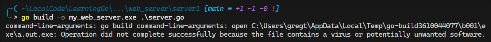
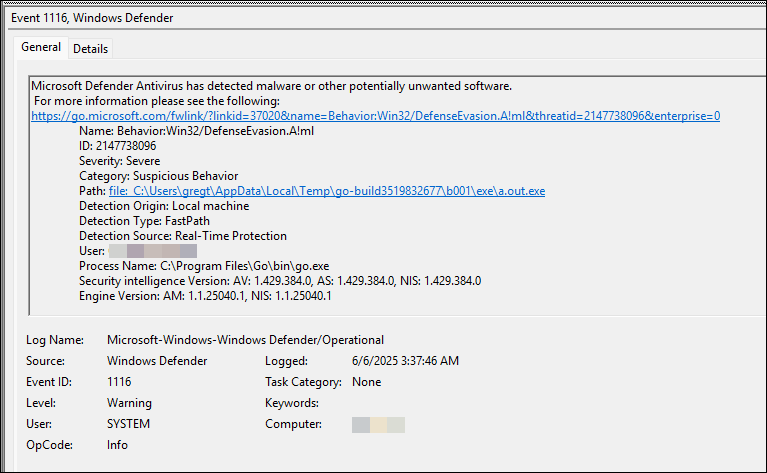
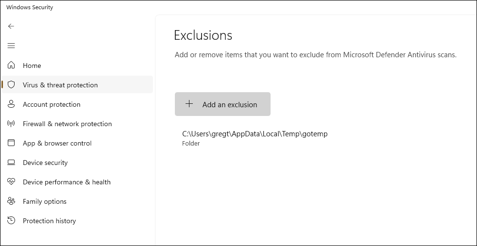

# My Notes on the Go Programming Language

# Managing Windows Defender Exclusions

When building Go applications, Windows Defender may flag the temporary files created during the build process as potentially unwanted software (PUA).





To work around this issue, you can set the `TEMP` and `TMP` environment variables to a different directory within the active session:

```powershell
$env:TEMP = "C:\Users\gregt\AppData\Local\Temp\gotemp"
$env:TMP = "C:\Users\gregt\AppData\Local\Temp\gotemp"
```

Then, in Windows Defender, add an exclusion for the `gotemp` directory:


